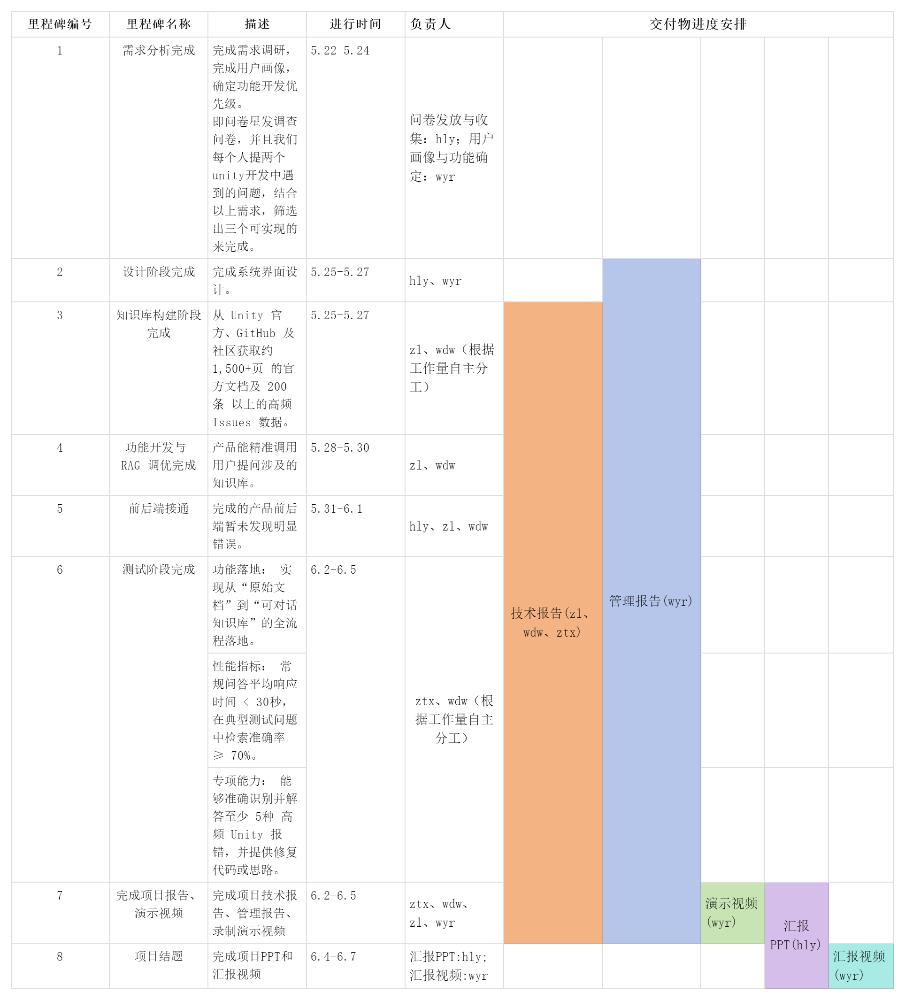

**0.大家都看**

**进度与里程碑一览表**

**文档使用说明**

标题从1. -7. 的文档用于存放各阶段的过程与成果

注意过程留痕，方便写报告

谁完成了自己负责的过程就在微信群里说一声

**重温lab1里我们提的需求**

**成员洪莉雅需求**：项目需打造简洁直观的交互界面，整体操作流程严格贴合普通用户的日常使用习惯，最大限度降低用户的学习成本，保证无相关基础的用户也能快速上手操作，高效获取所需帮助，核心聚焦用户体验与易用性。项目需提供简洁直观的交互界面，操作流程符合用户的使用习惯，降低学习成本，让用户能快速上手获取帮助。

**成员王薏儒需求**：打造一款智能助手工具，具备精准识别用户代码内bug的核心能力，识别完成后向用户反馈详细bug信息，待用户明确同意授权后，可直接在用户本地工程文件中完成bug修复，全程流程简化、操作便捷，大幅提升代码调试效率，核心聚焦代码问题自动化处理。

**成员王代炜需求**：针对Unity游戏开发引擎版本更迭速度快、旧版API频繁弃用的行业痛点，智能助手需搭载专属“版本对标功能”；用户可自主指定旧版API（例如旧版物理系统相关接口），助手能够精准匹配并给出Unity 2023 LTS及以上高版本中的等效替代方案，同时同步整理官方API弃用说明的核心摘要，方便开发者快速适配版本，核心聚焦引擎版本兼容痛点。

**成员张惏需求**：智能助手需实现两大核心能力，一是定制化问答，彻底拒绝泛化、通用的模板式回答，针对用户提供的具体代码片段、实际开发场景，生成专属、可落地的修改建议，而非单纯搬运官方通用文档内容；二是多维混合检索，同步整合语义检索（精准匹配用户问题核心意图）、关键词检索（精准定位API与官方文档章节）、GitHub Issues检索（匹配社区同类已解决问题）三大检索模式，融合筛选出Top3最优检索结果后整合输出，核心聚焦回答精准度与检索效率。

**成员郑彤轩需求：**针对Unity开发者日常调试、版本适配、bug修复的工作场景，助手需新增开发日志一键导出与问题复盘功能，用户可将与助手的对话记录、bug识别结果、版本适配方案、代码修改建议等内容，一键导出为规范的Markdown格式文档；同时支持按问题类型、时间节点分类归档，方便开发者后续复盘问题、整理项目开发笔记，也便于小组协作时同步问题解决方案，核心聚焦开发过程留存与协作效率提升。